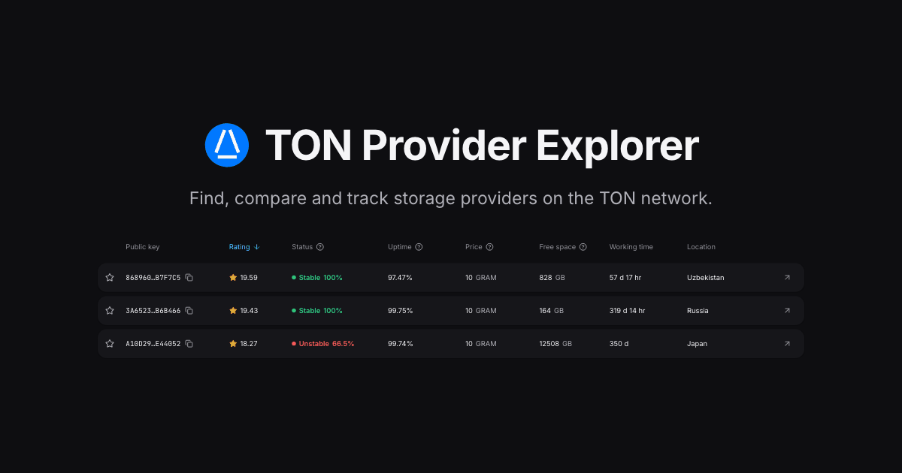

# 💎 TON Provider Explorer

[](LICENSE)
[](https://www.typescriptlang.org/)
[](https://react.dev/)
[](https://www.docker.com/)



**TON Provider Explorer** is a web catalog of TON Storage providers. Browse the list with search, sorting and
filters, open any provider to see its status, telemetry, hardware and network details, and pin favorites — theme
and language are remembered by the browser.

## Usage

Requires Node 22 and pnpm 11.

1. Install dependencies:

   ```bash
   pnpm install
   ```

2. Start the dev server:

   ```bash
   pnpm dev
   ```

The app starts on `:5173` — or the next free port, if that one is taken — and fetches providers from the public catalog API.

Opening `#<pubkey>` shows that provider straight away; the key is case-insensitive.

### Production build

```bash
pnpm build
```

The app is built into static files in `dist/`, served by any static host. To check the result locally:

```bash
pnpm preview
```

Unit tests cover `src/lib`:

```bash
pnpm test
```

Two optional build-time variables point at the production site by default and are baked into the bundle:

| Variable        | Description                                                   | Default                            |
|-----------------|---------------------------------------------------------------|------------------------------------|
| `VITE_API_URL`  | Base URL serving `/providers/search`                          | `https://mytonprovider.org/api/v1` |
| `VITE_SITE_URL` | Origin the app is served from, for absolute links in previews | `https://mytonprovider.org`        |

To build for another origin:

```bash
VITE_API_URL=https://example.com/api/v1 \
VITE_SITE_URL=https://example.com \
pnpm build
```

## Docker

To run a self-hosted instance (behind your own reverse proxy, for example) without installing Node:

```bash
docker compose up -d --build
```

The app is served on `${PORT}`, which falls back to `:8080`. Copy `.env.example` to `.env` and set `PORT`, `VITE_API_URL` and `VITE_SITE_URL` there — compose reads `.env` on its own.

To only build the static files without Node or a running container:

```bash
docker build --target dist --output dist .
```

## Deployment

Every push to `master`, and every pull request, runs lint, tests and build in CI.

Deployment is self-hosted: pull `master` on the host and rebuild the container as shown in [Docker](#docker).

Publishing to GitHub Pages is still available through `pnpm run deploy` — it builds with
`--base /mytonprovider-frontend/` and pushes to a `gh-pages` branch — but it is not in use,
and the Pages site is switched off.

## License

This repository is distributed under the [Apache License 2.0](LICENSE).
